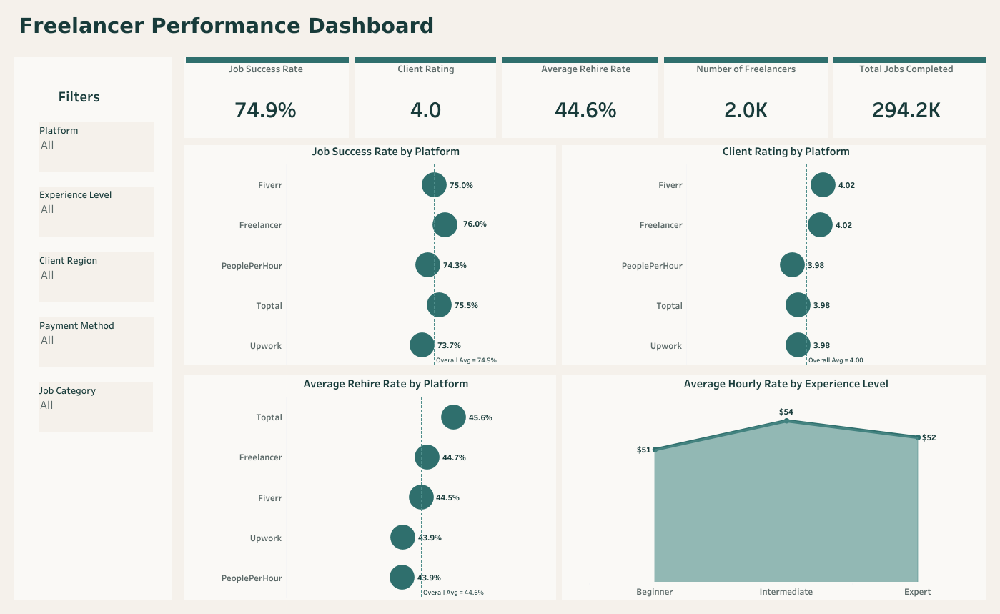
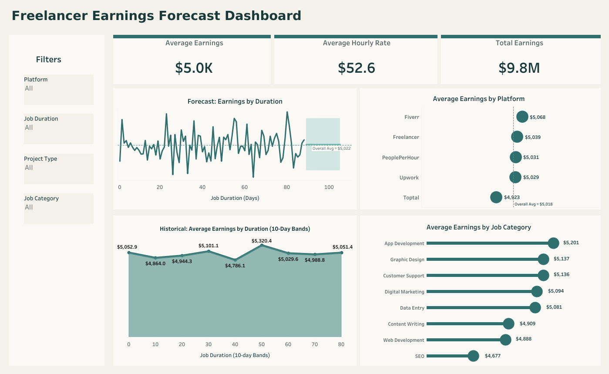

# Freelance Marketplace Analytics Dashboards in Tableau

## Overview
This project analyzes freelancer performance, earnings patterns, and marketplace trends across digital freelancing platforms. Using Tableau, I combined and analyzed freelancer and project data to build two interactive dashboards: a Freelancer Performance Dashboard and an Earnings Forecast Dashboard.

## Business Problem
Freelance marketplace data can be difficult to interpret without structured analysis and visualization. The goal of this project was to transform raw platform and freelancer data into clear, decision-ready insights that support performance monitoring, earnings analysis, and marketplace trend evaluation.

## Tools Used
- Tableau
- Table Joins
- Calculated Fields
- KPI Cards
- Interactive Filters
- Forecasting
- Trend Analysis
- Comparative Analysis
- Dashboard Design
- Data Visualization

## Dataset Overview
The dataset includes freelancer and job-related variables such as:
- Freelancer ID
- Platform
- Job Success Rate
- Client Rating
- Rehire Rate
- Hourly Rate
- Total Jobs Completed
- Total Earnings
- Job Duration
- Experience Level
- Client Region
- Payment Method
- Project Type
- Job Category

## Project Workflow
1. Imported and joined the required tables in Tableau using `freelancer ID`.
2. Reviewed and validated data types for analysis.
3. Built calculated metrics and KPI cards for performance and earnings tracking.
4. Developed a Freelancer Performance Dashboard to compare job success rate, client rating, rehire rate, and hourly rate patterns.
5. Developed an Earnings Forecast Dashboard to analyze average earnings, category performance, and projected earnings trends.
6. Added interactive filters to support dynamic exploration across platform, experience level, project type, job category, and duration.

## Dashboard Previews

### Freelancer Performance Dashboard

Interactive Tableau dashboard showing freelancer performance across platforms through KPIs, platform comparisons, and filters for experience level, region, payment method, and job category.

[Click here to view the Freelancer Performance Dashboard on Tableau Public](https://public.tableau.com/app/profile/edidiong.ekanem/viz/FreelanceGigAnalyticsDashboard-FreelancerPerformance/FreelancerPerformanceDashboard1)

### Earnings Forecast Dashboard

Interactive Tableau dashboard analyzing earnings patterns, category-level performance, and forecasted earnings trends by job duration, platform, and project characteristics.

[Click here to view the Earnings Forecast Dashboard on Tableau Public](https://public.tableau.com/app/profile/edidiong.ekanem/viz/FreelanceGigAnalyticsDashboard-FreelancerEarningsForecast/EarningsForecastDashboard2)

## Key Insights
- Job success rate and client rating were fairly consistent across platforms, with only modest variation.
- Rehire rate differences helped highlight variation in repeat engagement across platforms.
- Intermediate freelancers showed the highest average hourly rate among the experience groups.
- Average earnings were relatively similar across platforms, suggesting a competitive marketplace.
- Some job categories generated stronger average earnings than others, indicating higher-value specialization areas.
- Historical job duration patterns showed relatively stable earnings with some variation across duration bands.
- Forecasting added a forward-looking view of expected earnings based on duration trends.

## Recommendations
- Improve retention strategies in lower-rehire segments by strengthening client follow-up, service quality monitoring, and repeat-hire incentives.
- Refine pricing and positioning by experience level and job category to better align freelancers with higher-earning opportunities.
- Use historical earnings and duration patterns to guide project packaging, revenue planning, and forecasting decisions.
- Monitor platform performance across multiple metrics, including success rate, client rating, rehire rate, and earnings, to support more balanced strategic decisions.

## Files Included
- `README.md`
- `Table_1_Freelancer_Details.xlsx`
- `Table_2_Job_and_Earnings_Data.xlsx`
- `freelancer-performance-dashboard-preview.png`
- `freelancer-earnings-forecast-dashboard-preview.png`
- `FreelanceGig_Project_Overview.docx`
- `FreelanceGig_Presentation_Slides.pptx`

## What This Project Demonstrates
This project demonstrates my ability to prepare and combine datasets in Tableau, build calculated metrics and KPI-driven dashboards, analyze performance and earnings patterns, apply forecasting in a business analytics context, design interactive dashboards for decision-making, and communicate findings clearly through data visualization.
